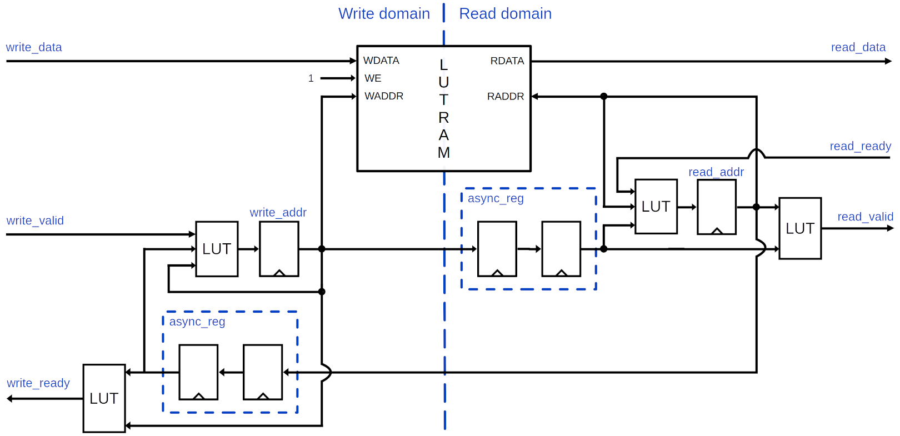
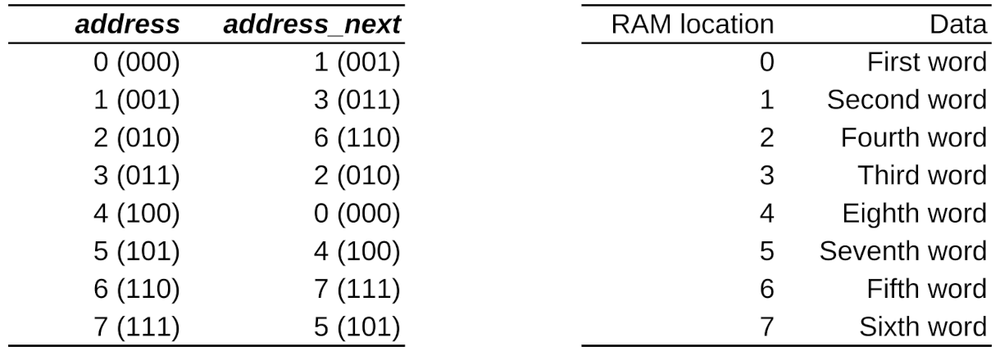

This repository contains demo code for an alternative asynchronous FIFO design using Gray-coded address lookup tables instead of arithmetic.
Can be used in FPGA or ASIC projects.
See the [source code](modules/funny_fifo/src) for all details.




# Use Gray address lookup table instead of binary arithmetic

A traditional FIFO uses binary address counters, which are selectively incremented depending on whether a write/read operation occurs.
These binary counters are then converted to Gray code and passed between the two clock domains.
In the other clock domain, they are then converted to binary again for comparison.
Just typing this out makes you realize how horribly inefficient this is.

Instead, I suggest using only Gray-coded address values.
We can not perform arithmetic on a Gray-coded value without converting it to binary, so let's not perform arithmetic.
Let's look up the next address using LUTs:



Note that if you follow **address** via **address_next** in the left table, it goes through the traditional Gray code sequence 000, 001, 011, 010, 110, 111, 101, 100, 000.
The data placement in RAM looks a little intimidating at first, but as long as we do the same thing on the read side as on the write side, this is not a problem.

The upside of this is, of course, that we can get our next address using a single LUT lookup per address bit.
No carry chain, no binary-Gray-binary conversion, no separate FFs for binary and Gray values.
A single LUT.

Beyond a depth of 63, the address lookup will require two LUTs per bit.
A depth of 7 is still optimal, though, since it means that address comparisons fit in a single LUT.


# Trade RAM utilization efficiency for a shorter critical path

A traditional 8-depth FIFO represents 9 states using two 4-bit state (address) counters.
States: 0 words in FIFO (empty) through 8 words in FIFO (full).
This is clearly an inefficient usage of the state counters, since 9 states are represented using 4 bits, which technically allows for 16 states.
The upside is that data can be written to every location in the RAM, and the RAM can be truly "full".

I suggest, instead, decreasing the state (address) counters to 3 bits, which represent 8 states: 0 words in FIFO (empty) through 7 words in FIFO (full).
This is now a perfect utilization of the address counters, but a sub-optimal usage of the RAM.
But I would argue that it's worth it, since the critical path in a FIFO is likely in the address handling, so optimizing that enables a higher clock frequency.


## Lower `write_valid` load

A traditional FIFO would have some logic like this on the write side:

```VHDL
if write_ready and write_valid then
  ram(write_address) <= write_data;
end if;
```

But we can actually skip that, and write unconditionally, since one position in the RAM is always unused with this design.
This makes the critical path and fanout of `write_ready` and `write_valid` less, which is highly beneficial.


# Use depth 7 or 31

(I use "depth" synonymous to "capacity", i.e. how many words the FIFO can hold. A FIFO of this design with depth `N` will use a RAM with `N + 1` locations)

If you use a FIFO of depth 7, the addresses fit in 3 bits, which means that the comparisons

```VHDL
read_valid <= write_address /= read_address;
write_ready <= write_address_next(write_address) /= read_address;
```

both fit in a single 6-input LUT each.
If you need a greater capacity, 31 is a satisfyingly efficient step since

1. the `write_ready`/`read_valid` expression fits in two LUTs (10 inputs), and
2. the `write_add`/`read_addr` expression fits precisely in two LUTs (11 inputs), and
3. the RAM fits precisely in one LUTRAM per bit.


# Drawbacks

Since binary-coded addresses are never available, you can not have a `level` out port.
Or `almost_full` or `almost_empty` status signals.
Unless, of course, you want to convert your Gray code to binary code.


# Unit test

Run with:

```
python 3 -m pytest -n32 test_funny_fifo.py
```

Requires cocotb version 2+ (currently in development).


# Build FPGA

Full test build available with constraints.
Run with:

```
python 3 build_fpga.py --list
```

